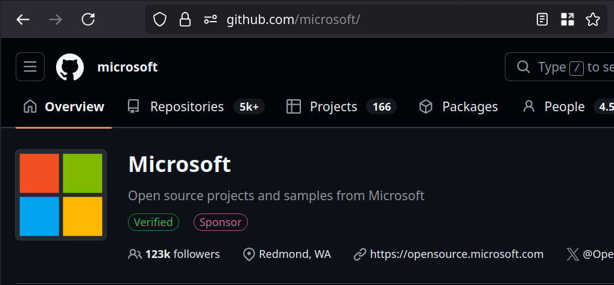
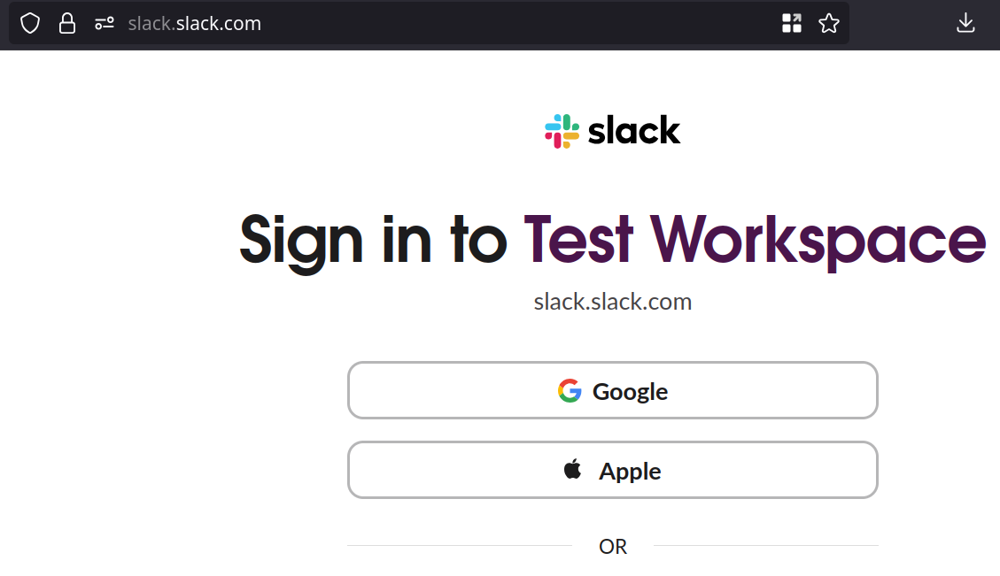

# SaaSquatch

A CLI tool, written in Golang, designed to help discover and verify an organisation's presence on various SaaS platforms.

The core function is to test a given identifier (or a list of identifiers) against a collection of predefined rules. Each rule targets a specific SaaS endpoint and uses a flexible YAML definition to confirm a valid presence by analysing the HTTP response.

Examples of such endpoints include DNS subdomains like `<company>.slack.com` and URL identifiers `github.com/microsoft`.





## Quick Start

To run SaaSquatch, you need two things: the binary and some rules.

You can either download the appropriate release for your system from the [**releases page**](https://github.com/tantosec/saasquatch/releases) (which includes the rules) or use the provided Docker image. Pin to a specific version for reproducible, supply-chain-safe runs:
```sh
docker run --rm ghcr.io/tantosec/saasquatch:v1.0.0 -i google

# or, for the newest build (unpinned — convenient, but not reproducible):
docker run --rm ghcr.io/tantosec/saasquatch:latest -i google
```

The Docker image bundles the default rules at `/app/rules`. To run with your own rules or config, mount them into the container and point SaaSquatch at the mounted paths with `-r` / `--config`:
```sh
docker run --rm \
  -v "$(pwd)/rules:/app/rules" \
  -v "$(pwd)/config.yaml:/config.yaml" \
  ghcr.io/tantosec/saasquatch:v1.0.0 --config /config.yaml -i google
```

When running the **native binary**, SaaSquatch stores its config under `$XDG_CONFIG_HOME` (`~/.config/saasquatch` by default), following the XDG Base Directory Specification. Check `--help` to see where your configuration file is installed.

The simplest way to run SaaSquatch is using the `-i` flag to provide a single identifier:
```sh
./saasquatch -i google
```
Choose your identifier carefully. SaaSquatch tests the *exact* identifier you provide; it does not discover, expand, or correct it. If you search `acme` when the real identifier is `acmecorp`, any hits are genuine presences for whatever entity actually uses `acme`, which may be an unrelated organisation sharing a generic name, essentially a false positive. The longer and more specific your identifier, the more likely the results are really your target.

```
SaaSquatch is a CLI tool to discover and verify an organisation's presence on various SaaS platforms using YAML based rules.

By default, the tool runs in 'Test Rules' mode, which validates your rule files.
Provide an identifier (-i) or an identifier file (-I) to run against one or more live targets.

Usage:
  SaaSquatch [flags]

Flags:
      --config string            config file (default is the OS user-config dir, e.g. ~/.config/saasquatch/config.yaml)
  -h, --help                     help for SaaSquatch
  -i, --identifier string        Test a single identifier (infers live mode)
  -I, --identifier-file string   Path to a file of identifiers (infers live mode)
      --ignore-env-proxies       Ignore HTTP_PROXY/HTTPS_PROXY/ALL_PROXY environment variables (force direct unless --proxy is set)
      --jsonl                    Enable line-delimited JSON output for STDOUT
      --lru-cache-size int       Maximum number of responses to keep in the LRU cache (default 1024)
  -o, --output-file string       Path to write JSON output file
      --proxy string             HTTP/SOCKS5 proxy URL (e.g., http://127.0.0.1:8080)
      --random-agent string      Path to a file of User-Agents for random selection
      --regenerate-config        Back up the existing config file and write a fresh default, then exit
  -r, --rules string             Path to a YAML rule file or a directory of rules (default "./rules/")
      --tags strings             Comma-separated list of tags to run (e.g., "dev,chat")
  -t, --threads int              Number of concurrent threads/goroutines (default 50)
      --timeout int              Request timeout in seconds (default 10)
      --user-agent string        Set a custom User-Agent string (default "SaaSquatch")
  -v, --verbose count            Enable debug logging (-v)
```

**Note:** MacOS Gatekeeper may block execution of downloaded copies of SaaSquatch. [How to allow](https://support.apple.com/en-au/102445#:~:text=If%20you%20want%20to%20open)

---

## Writing Rules

SaaSquatch uses a simple YAML format for defining rules. For a complete guide on how to write rules, develop new ones, and for a full list of our standard tags, please see our docs:

-   **[Rule Definition Guide](./docs/RULES_DEFINITION.md)**: A complete reference for all fields in a rule file.
-   **[Rule Tagging Guide](./docs/RULE_TAGGING_GUIDE.md)**: The official list of tags for categorising rules.
-   **[Rule Development Guide](./docs/RULES_DEVELOPMENT.md)**: Tips and best practices for creating and testing new rules.

---

### Building from Source

Requires [Go](https://go.dev/dl/) 1.26+.

```sh
git clone https://github.com/tantosec/saasquatch.git
cd saasquatch
go build .
./saasquatch --help
```

Or build the Docker image:

```sh
docker build -t saasquatch .
```

---

## Licence

SaaSquatch is released under the [MIT License](./LICENSE) — you are free to use,
modify, and distribute it, including commercially, provided the copyright notice
and licence text are retained.

Bundled dependencies carry their own licences; see
[THIRD-PARTY-NOTICES.md](./THIRD-PARTY-NOTICES.md).